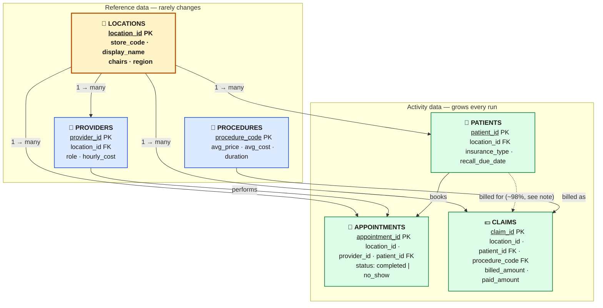
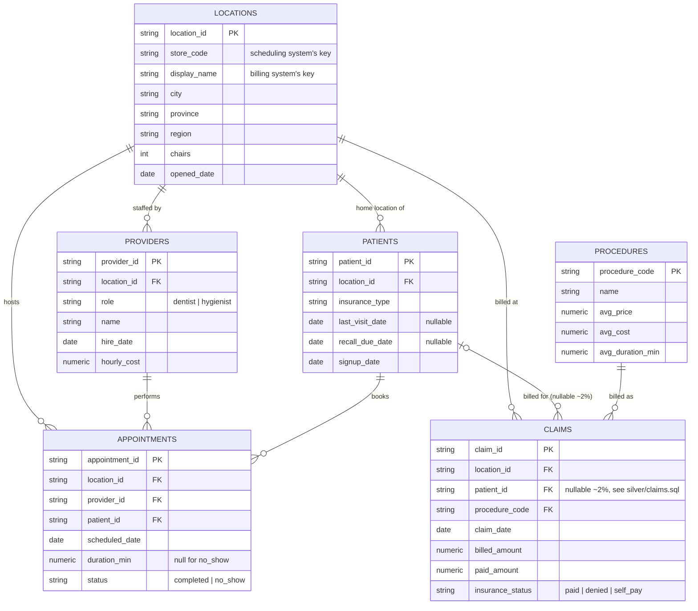

# Silver Layer ERD

How the six `silver.*` tables (see [sql/silver/](../sql/silver/)) relate,
once the three bronze source systems' different location-key schemes
(`store_code`, `display_name`, numeric `location_id`) have already been
resolved to one canonical `location_id`.

🟠 **Locations** is the hub every other table resolves against — the
canonical `location_id` that replaced three source-system-specific keys.
🔵 **Blue** = reference/dimension data. 🟢 **Green** = activity/fact data
that grows with every pipeline run. The dashed edge (`PATIENTS ⇢ CLAIMS`)
marks the one non-total relationship: `claims.patient_id` is null for ~2%
of rows (an unresolved self-pay/walk-in in the source billing system) — see
[sql/silver/claims.sql](../sql/silver/claims.sql) for why those rows are
deliberately excluded from de-duplication rather than silently merged.

<b>Full column reference</b> (every column, not just keys)

## Notes

- **`LOCATIONS`** is the canonical dimension every other table resolves
  against — `PROVIDERS`/`PATIENTS` already carry the numeric `location_id`
  directly from their bronze source, while `APPOINTMENTS` and `CLAIMS` are
  joined in via `store_code` and `display_name` respectively (see
  [sql/silver/appointments.sql](../sql/silver/appointments.sql) and
  [sql/silver/claims.sql](../sql/silver/claims.sql)).
- No FK constraints are enforced in Postgres here (each silver table is a
  `DROP`/`CREATE TABLE AS` rebuild every run, not an incrementally-loaded
  table) — this diagram documents the logical relationships the SQL joins
  rely on, not physical constraints.
